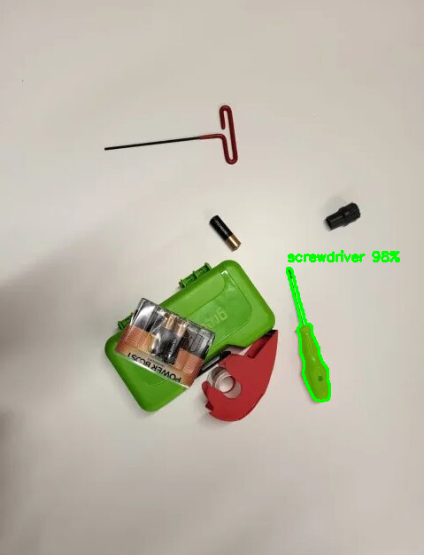
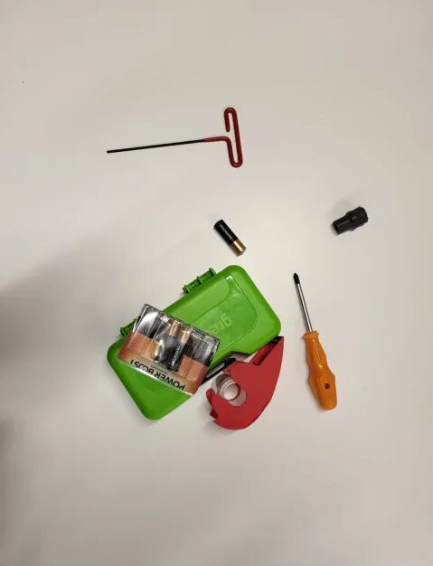

# 🔦 The ToolFinder

> **"Where is my drill bits?"** — and the workspace answers.

The ToolFinder is a hands-free, voice-activated AI assistant that **identifies, segments, and highlights** the tools you ask for in real time — returning pixel-precise masks, confidence scores, and physical coordinates. Optionally, a dual-servo laser rig points a physical dot right at the object.

It runs multiple large vision models in parallel on **Modal's serverless GPU infrastructure** — no hardware to manage, warm containers for low latency, and A10G + H100 scaling on demand.

Built at **HackIllinois 2026**.

<p align="center">
  
  
</p>

---

## Table of Contents

- [The Problem](#-the-problem)
- [What It Does](#-what-it-does)
- [A Concrete Walkthrough](#-a-concrete-walkthrough)
- [Architecture](#-architecture)
- [Tech Stack](#-tech-stack)
- [Repository Layout](#-repository-layout)
- [Getting Started](#-getting-started)
- [Configuration & Secrets](#-configuration--secrets)
- [API Reference](#-api-reference)
- [The Math](#-the-math)
- [Hardware — Laser Pointer Rig](#-hardware--laser-pointer-rig)
- [Roadmap](#-roadmap)
- [Acknowledgements](#-acknowledgements)

---

## 🧩 The Problem

Construction and workshop professionals lose an average of **38 hours per year** searching for tools — nearly an entire workweek gone before the real work begins. In some environments, workers report spending up to **47% of their time locating tools** instead of using them. Across industries, employees spend roughly **25% of their day searching for information or equipment**.

That inefficiency scales fast: a 10-person workshop can lose **hundreds of hours a year** looking for objects that are physically present in the room.

The ToolFinder is built for **frontline workers** — construction crews, repair technicians, warehouse operators, lab teams, and hardware engineers — the people who face the highest operational friction yet often have the least access to advanced AI.

---

## ⚡ What It Does

The ToolFinder is a multimodal AI system that:

1. Accepts natural speech from a user.
2. Converts speech into structured detection queries.
3. Captures a live camera frame.
4. Sends the frame to a Modal-hosted GPU detection pipeline.
5. Runs parallel GPU-accelerated detection **and** segmentation.
6. Returns an annotated image with **pixel-precise masks**, **confidence scores**, and **object centroids**.
7. Optionally aims a physical laser pointer at the object.

Instead of keyword matching, it performs **semantic understanding** — mapping conversational speech to the right tool.

| User Speech | Structured Output |
| --- | --- |
| "Hand me the flathead you're holding" | `Screwdriver` |
| "Where is the green case?" | `Screwdriver Kit` |
| "Pass me the motor controller" | `Motor Controllers` |
| "Where's my hammer?" | `Hammer` *(open-vocabulary)* |

If an object was never explicitly trained (e.g. *"Where is my hammer?"*), the request is routed to an **open-vocabulary segmentation model** that detects objects purely from a text prompt.

---

## 🔎 A Concrete Walkthrough

**User says:**

> "I need to find the key and clean up my space."

**Step 1 — Transcription**

```
"I need to find the key and clean up my space"
```

**Step 2 — Semantic mapping** (LLM router)

```
Allen key
Clutter
```

The router interprets `"key" → Allen key` (contextual workshop mapping) and `"clean up" → Clutter` (intent-based mapping). Each line becomes an independent detection job.

**Step 3 — Detection** (from the Modal GPU backend)

```json
{
  "image": "<base64 PNG>",
  "detections": [
    { "label": "Allen key", "score": 0.88, "cx": 310, "cy": 224 },
    { "label": "Clutter",   "score": 0.76, "cx": 540, "cy": 190 }
  ],
  "count": 2
}
```

**Step 4 — Visual result**

- Allen key highlighted in green, clutter items in cyan.
- Mask contours drawn, confidence percentages rendered near each object.

This is not hardcoded detection — it's **contextual semantic routing** combined with **GPU-scale multimodal inference**.

---

## 🏗 Architecture

A five-layer multimodal pipeline, with **Modal as the compute backbone** orchestrating the GPU detection layer.

```
   🎙  Speech                🧠  Semantic              🎥  Frame
   (Whisper / Web       →    Router (LLM)         →    Capture (ESP32 /
    Speech API)              maps → tool classes        Pi / webcam / test)
                                                              │
                                                              ▼
                           ⚙️  Modal GPU Pipeline  ──────────────────────
                           ┌──────────────────────┬──────────────────────┐
                           │ YOLO + SAM2  (A10G)   │  SAM3  (H100)         │
                           │ structured classes    │  open-vocabulary      │
                           └──────────┬────────────┴───────────┬──────────┘
                                      └─── parallel + composite ┘
                                                              │
                                                              ▼
                           🖼  Annotated image + centroids  →  🔴 Laser rig
```

### 1️⃣ Speech Input Layer

Two capture modes:

- **Local microphone** — `silero-VAD` processes 512-sample chunks at 16 kHz. When speech confidence > `0.65`, audio is buffered; after ~600 ms of silence the buffer is transcribed with **Whisper (base)**. A ~800 ms minimum-speech gate suppresses false triggers.
- **Browser** — the **Web Speech API** transcribes in real time and posts the transcript to the backend.

Both produce a clean transcript string.

### 2️⃣ Semantic Mapping Layer

The transcript is sent to an **LLM semantic router** that performs entity extraction, context disambiguation, intent recognition, and class normalization.

- `app/voice_agent.py` (the current server pipeline) uses **Groq (Llama-3.3-70B)**.
- `experiments/legacy-clip/voice_agent.py` (the legacy local-mic pipeline) uses **Gemini 2.5-Flash**.

Known tools map to exact **YOLO class names**; unknown-but-real objects become short descriptive phrases for **SAM3 open-vocabulary** search. Each output line becomes a detection job.

### 3️⃣ Frame Capture Layer

Acquisition priority: **test image** (offline) → **ESP32 / Raspberry Pi camera stream** (primary) → **local webcam** (fallback).

The Pi streams over a simple length-prefixed TCP protocol:

```
[4 bytes: uint32 payload length][L bytes: JPEG image data]
```

which the backend reconstructs with `Image.open(io.BytesIO(payload)).convert("RGB")`.

### 4️⃣ GPU Detection Pipeline (Modal)

This layer runs entirely on **Modal** — provisioning GPUs on demand, loading models once at container startup, keeping containers warm, and running detection jobs in parallel per request.

The Modal app `detect-tools-combined` exposes two GPU classes:

| Class | GPU | Role |
| --- | --- | --- |
| `YoloSam2Detector` | A10G | YOLO detection + SAM2 (`facebook/sam-vit-large`) mask refinement |
| `Sam3Detector` | H100 | SAM3 (`facebook/sam3`) open-vocabulary segmentation |

**Dynamic routing** (`app/runmodalcombined.py`):

- Structured classes → **YOLO + SAM2** refinement.
- Unknown objects → **SAM3** open-vocabulary segmentation.
- Hybrid queries (e.g. `Clutter`, `Slider`, `Tape`, `Motor Controllers`) → run YOLO first, then **fall back to / augment with SAM3** if confidence is low or detections are missing, and **composite the overlays** onto one image.

Multiple prompts are dispatched concurrently via a `ThreadPoolExecutor`, and their overlays are merged onto a single frame.

### 5️⃣ Hardware Extension — Laser Pointer Rig

Mask centroids are fed to a dual-servo (yaw + pitch) laser system. Inverse kinematics are solved numerically to aim a physical dot at the detected object (see [`hardware/camera/kinematics.py`](hardware/camera/kinematics.py) and [`hardware/pi/servo.py`](hardware/pi/servo.py)).

---

## 🧰 Tech Stack

| Layer | Technology | Where it runs |
| --- | --- | --- |
| Structured detection | YOLO (custom, Roboflow `yolotrainingdatasethackillinois/2`) | Modal · A10G |
| Mask refinement | SAM2 — `facebook/sam-vit-large` | Modal · A10G |
| Open-vocabulary segmentation | SAM3 — `facebook/sam3` | Modal · H100 |
| Semantic routing | Gemini 2.5-Flash / Groq Llama-3.3-70B | API |
| Speech (local) | Whisper (base) + silero-VAD | CPU |
| Speech (browser) | Web Speech API | Browser |
| Backend | FastAPI + Uvicorn | Host `:8000` |
| Frontend | Vite · Vanilla JS · Tailwind (CDN) | Host `:5173` |
| Camera / hardware | Raspberry Pi · ESP32 · gpiozero servos | Edge devices |

### Detected Tool Classes

The custom YOLO model is trained on 14 workshop classes:

```
Allen key · Sensor Case · Camera · Pins · Screwdriver Kit · ESP32 · Screwdriver
Motor · Drill Bits · Clutter · Brush · Slider · Tape · Motor Controllers
```

Anything outside this set is handled open-vocabulary by SAM3.

---

## 📁 Repository Layout

```
ToolFinder/
├── README.md
├── app/                        # ⭐ Canonical pipeline (the shipping product)
│   ├── server.py               #    FastAPI: POST /detect + WS /ws/detection
│   ├── voice_agent.py          #    Groq router + frame capture + orchestration
│   ├── runmodalcombined.py     #    Per-class routing → YOLO / SAM2 / SAM3
│   ├── maindetectorcombined.py #    Modal app: YoloSam2Detector + Sam3Detector
│   └── requirements.txt        #    Canonical Python deps (Groq + FastAPI)
│
├── frontend/                   # Vite + vanilla JS + Tailwind
│   └── src/{api,components}     #    WebSockets, camera grid, speech, results
│
├── hardware/
│   ├── pi/                     # Runs on the Pi: camera TCP stream + servo control
│   ├── host/                   # Host-side camera / RealSense receivers
│   └── camera/                 # Camera capture, kinematics, laser-aim bridge
│
├── experiments/                # Archived spikes & superseded pipelines
│   ├── legacy-clip/            #    Older Gemini + CLIP single-model pipeline
│   ├── sam2-dino/              #    GroundingDINO + SAM2 variant
│   ├── sam3/                   #    SAM3-only variant
│   ├── yolo-sam2/              #    YOLO + SAM2 variant
│   ├── modal-spike/            #    Early Modal / SAM3 test scripts
│   └── torch-pointer/          #    Pygame/OpenGL aim visualizer
│
└── assets/                     # Demo inputs (test*.jpg) + sample outputs (result*.png)
```

---

## 🚀 Getting Started

### Prerequisites

- Python 3.11+
- Node.js 18+ (for the frontend)
- A [Modal](https://modal.com) account (`pip install modal && modal setup`)
- API keys: Google Gemini **or** Groq, a Hugging Face token (for SAM3), and Roboflow (for the YOLO model)

### 1. Deploy the GPU backend to Modal

```bash
pip install -r app/requirements.txt

# Create Modal secrets used by the detectors
modal secret create roboflow      ROBOFLOW_API_KEY=...
modal secret create huggingface   HF_TOKEN=...

# Deploy the detection app (YoloSam2Detector on A10G, Sam3Detector on H100)
modal deploy app/maindetectorcombined.py
```

You can smoke-test the pipeline directly against a still image:

```bash
python app/runmodalcombined.py assets/test4.jpg Clutter Camera "Motor Controllers"
# → writes result.png with all overlays composited
```

### 2. Run the backend server

```bash
# .env with GROQ_API_KEY=... (and/or GEMINI_API_KEY=...)
python app/server.py               # serves on http://0.0.0.0:8000
```

### 3. Run the frontend

```bash
cd frontend
npm install
npm run dev                         # http://localhost:5173
```

> ⚠️ Speech recognition uses the **Web Speech API** — use **Chrome or Edge**. Firefox is unsupported.

### 4. (Optional) Local microphone mode

Skip the browser and drive the pipeline straight from a mic + still image:

```bash
python experiments/legacy-clip/voice_agent.py assets/test.jpg   # Whisper + silero-VAD + Gemini
```

---

## 🔐 Configuration & Secrets

| Name | Used by | Purpose |
| --- | --- | --- |
| `GEMINI_API_KEY` | `experiments/legacy-clip/voice_agent.py` | Gemini 2.5-Flash semantic routing |
| `GROQ_API_KEY` | `app/voice_agent.py` | Groq Llama-3.3-70B semantic routing |
| `HF_TOKEN` | Modal secret `huggingface` | Download SAM3 (`facebook/sam3`) |
| `ROBOFLOW_API_KEY` | Modal secret `roboflow` | Load the custom YOLO model |

Secrets are loaded from a `.env` file (`python-dotenv`) locally and from **Modal Secrets** in the GPU containers. `.env` is git-ignored — **never commit keys**.

Frontend knobs live at the top of the `frontend/src/api/*.js` files (camera ports, detection WS URL, REST base URL). Keep the `TOOLS` list in `src/components/speech.js` in sync with the Python class list.

---

## 📡 API Reference

**Backend base URL:** `http://localhost:8000`

### `POST /detect`

```json
{ "transcript": "Where are my drill bits?", "tools": [] }
```

The backend maps the transcript to tool classes, grabs a live camera frame, runs the Modal pipeline, and returns:

```json
{
  "count": 2,
  "detections": [
    { "label": "Allen key", "score": 0.88, "cx": 310, "cy": 224 },
    { "label": "Clutter",   "score": 0.76, "cx": 540, "cy": 190 }
  ],
  "image": "<base64 PNG>"
}
```

Returns `422` if nothing detectable is found in the transcript.

### `WS /ws/detection`

The same result payload is broadcast to all connected WebSocket clients so the results panel updates live.

---

## 📐 The Math

**Bounding-box conversion** — YOLO outputs $(x_c, y_c, w, h)$, converted to corners:

$$
x_1 = x_c - \frac{w}{2}, \quad x_2 = x_c + \frac{w}{2}, \quad
y_1 = y_c - \frac{h}{2}, \quad y_2 = y_c + \frac{h}{2}
$$

**Mask blending** — semi-transparent overlay onto the canvas:

$$
\text{canvas}[mask] = 0.55 \cdot \text{canvas}[mask] + 0.45 \cdot \text{color}
$$

**Centroid** — mean of masked pixel coordinates (guaranteed to lie inside irregular shapes, which matters for servo pointing):

$$
c_x = \text{mean}(x_s), \quad c_y = \text{mean}(y_s), \quad \text{where } (y_s, x_s) = \text{where}(mask)
$$

**Laser aiming** — yaw rotation and ray–plane intersection:

$$
R_y =
\begin{bmatrix}
\cos\theta & -\sin\theta & 0 \\
\sin\theta & \cos\theta & 0 \\
0 & 0 & 1
\end{bmatrix},
\qquad
t = -\frac{z_0}{d_z}, \quad
x = x_0 + t\,d_x, \quad
y = y_0 + t\,d_y
$$

Inverse kinematics for the two servos are solved via numerical optimization.

---

## 🔴 Hardware — Laser Pointer Rig

- **Camera source:** Raspberry Pi streams JPEG frames over length-prefixed TCP on port `9999` ([`hardware/pi/streamSender.py`](hardware/pi/streamSender.py)).
- **Actuation:** dual-servo yaw/pitch mount driven by `gpiozero` ([`hardware/pi/servo.py`](hardware/pi/servo.py)).
- **Aiming:** centroids → world coordinates → servo angles via the kinematics model in [`hardware/camera/kinematics.py`](hardware/camera/kinematics.py).

---

## 🗺 Roadmap

- 📱 Mobile deployment
- 🧠 On-device inference
- 🕶 AR overlays
- 📦 Inventory tracking integration
- 🎥 Multi-camera fusion
- 🔮 Predictive workspace optimization

---

## 🙏 Acknowledgements

- **[Modal](https://modal.com)** — serverless GPU infrastructure that makes parallel A10G + H100 inference deployable in hours, not weeks.
- **Meta AI** — SAM2 & SAM3 segmentation models.
- **Roboflow** — custom YOLO training & hosted inference.
- **Google Gemini** and **Groq** — LLM semantic routing.
- **OpenAI Whisper** & **silero-VAD** — speech transcription.

Built with ☕ and cluttered workbenches at **HackIllinois 2026**.
